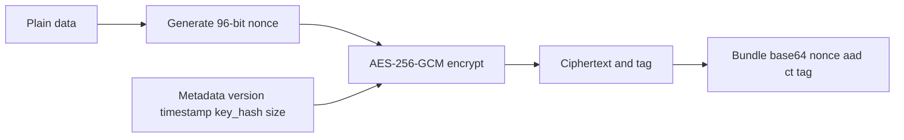
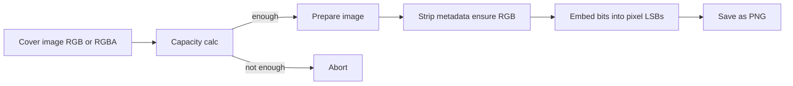
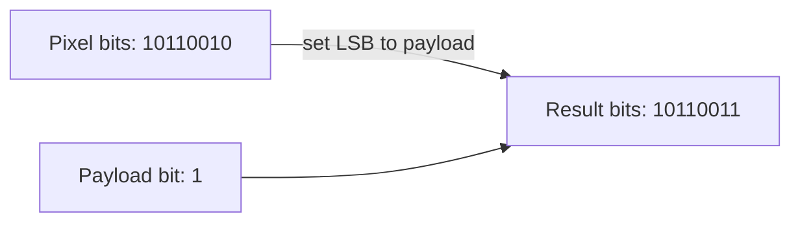

# 🔐 SecureStego – Enterprise Image Steganography

Military‑grade image steganography with AES‑256‑GCM encryption and an elegant Streamlit UI.


---

## ✨ What You Get

- **🛡️ Strong Crypto**: AES‑256‑GCM, PBKDF2 (600k iters), CSPRNG keys
- **🖼️ Invisible Hiding**: LSB steganography in lossless images (PNG/BMP/TIFF)
- **📂 Key Manager**: Generate, import, export, delete keys with fingerprints
- **📊 Analytics**: Operation history, totals, and charts
- **🎛️ Modern UX**: Dark theme, progress bars, drag‑and‑drop

---

## 🧠 How It Works (Overview)

### 1) Crypto Layer (AES-GCM)



- Authenticated encryption ensures confidentiality and tamper detection.
- AAD (Additional Authenticated Data) = JSON metadata (not encrypted, but verified).

### 2) Stego Layer (LSB)



- Each pixel channel contributes 1 bit in its least significant bit.
- Works best on lossless formats; recompression may destroy payload.

### Capacity Formula

For an image of size \(w\times h\) with \(c\) channels (RGB→3, RGBA→4):

\[\text{capacity\_bytes} = \left\lfloor \frac{w \times h \times c}{8} \right\rfloor - \text{overhead}\]

SecureStego uses an overhead of 200 bytes for safety.

---

## 🖼️ Visual Intuition – LSB Steganography



Only the least significant bit changes, so the pixel color change is imperceptible.

---

## 📦 Installation

1) Clone and enter the project

```bash
git clone https://github.com/your-org/SecureStego.git
cd SecureStego
```

2) Create a virtual environment (recommended)

```bash
python -m venv .venv
source .venv/bin/activate   # Windows: .venv\Scripts\activate
```

3) Install dependencies

```bash
pip install -r requirements.txt
```

4) Run the app

```bash
streamlit run app.py
```

---

## 🚀 Quick Start

1) Go to `🔑 Key Manager` → Generate your first key.
2) Open `🔐 Hide Data` → upload a PNG/BMP/TIFF cover image.
3) Enter a text message or upload a file to hide.
4) Choose your key and click “Encrypt & Hide”.
5) Download the produced stego image.
6) Later, open `🔓 Reveal Data` → upload the stego image, provide the same key, and click “Reveal”.

---

## 🧭 App Structure

- `app.py`: Landing page with navigation and stats
- `pages/1_🔐_Hide_Data.py`: Encrypt data and embed with LSB
- `pages/2_🔓_Reveal_Data.py`: Extract and decrypt
- `pages/3_🔑_Key_Manager.py`: Key generation/import/export
- `pages/4_📊_Analytics.py`: Charts and usage history
- `utils/crypto_engine.py`: AES‑GCM engine and helpers
- `utils/stego_engine.py`: Image validation, capacity, hide/reveal
- `utils/key_manager.py`: Key storage (.key.json) with fingerprints
- `utils/analytics.py`: Append‑only usage logs and stats

---

## 🔒 Security Details

- AES‑256‑GCM with 96‑bit nonce and 128‑bit tag
- PBKDF2‑HMAC‑SHA256 with 600k iterations (when deriving from a password)
- Keys are 32 bytes (256‑bit) generated via `secrets.token_bytes()`
- Each bundle records `version`, `timestamp`, `key_hash`, and `size` in AAD
- Wrong key or modified data → authentication failure (no partial plaintext)

---

## 🧪 Supported Images and Limits

- Formats: PNG, BMP, TIFF (lossless only)
- Minimum size: 100×100
- Practical capacity: about 3 bits/pixel (RGB) minus overhead; always check the capacity shown in the UI.

---

## 📊 Analytics

- All hide/reveal operations are logged in `analytics.json`.
- The Analytics page provides totals, recent operations, and charts.

---

## ⚠️ Best Practices

- Keep encryption keys separate from stego images.
- Do not re‑compress or edit stego images; this may destroy hidden data.
- Use a fresh key per project where feasible; rotate keys periodically.
- Treat exported key files as sensitive secrets.

---

## 🧰 Troubleshooting

- “No hidden data detected”: Wrong image, or the image was edited/compressed.
- “Authentication failed”: Wrong key or corrupted/tampered payload.
- “Insufficient capacity”: Use a larger image or hide a smaller payload.

---

## 📜 License

Rajas Patil © 2025 SecureStego contributors

---

## 🙌 Acknowledgements

- Built with Streamlit, Pillow, Cryptography, Pandas, Plotly
- LSB embedding conceptualization inspired by common steganography literature